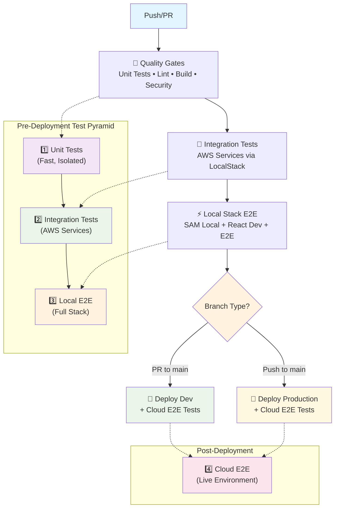

# Blue Demo Bank

A modern banking application demonstrating Blue Language integration and state-of-the-art serverless architecture.

## 🚀 Quick Start

### Prerequisites

- **Node.js 22+ (LTS)** - JavaScript runtime environment
- **npm** - Package manager
- **Docker** - Required for LocalStack (AWS service emulation)
- **AWS SAM CLI** - Required for local Lambda development and testing

#### Install AWS SAM CLI

Choose one of the following installation methods:

**Option 1: Using pip (Recommended)**

```bash
pip3 install aws-sam-cli
```

**Option 2: Using other methods**
See the [official AWS SAM CLI installation guide](https://docs.aws.amazon.com/serverless-application-model/latest/developerguide/install-sam-cli.html) for Windows, Linux, and other installation options.

**Verify Installation**

```bash
sam --version
```

> **⚠️ Troubleshooting SAM CLI**: If you get a "bad interpreter" error, SAM CLI may have been installed with an older Python version. Solutions:
>
> **Option 1: Reinstall with current Python**
>
> ```bash
> pip3 uninstall aws-sam-cli
> pip3 install aws-sam-cli
> ```
>
> **Option 2: Add Python bin to PATH** (if you see PATH warnings)
>
> ```bash
> # Add to your shell profile (.zshrc, .bashrc, etc.)
> export PATH="$(python3 -m site --user-base)/bin:$PATH"
> ```

### Run the Application

```bash
# 1. Install dependencies
npm install

# 2. Ensure Docker is running
npm run docker:check

# 3. Start all services (frontend, backend, localstack)
npm run serve:all
```

The app will be available at:

- **Frontend**: http://localhost:4200
- **Backend API**: http://localhost:3000
- **LocalStack**: http://localhost:4566

### Available Scripts

| Command                   | Description                               |
| ------------------------- | ----------------------------------------- |
| `npm start`               | Start development server                  |
| `npm test`                | Run tests for affected projects           |
| `npm run test:all`        | Run tests for all projects                |
| `npm run test:watch`      | Run tests in watch mode                   |
| `npm run e2e`             | Run E2E tests                             |
| `npm run build`           | Build affected projects                   |
| `npm run build:all`       | Build all projects                        |
| `npm run lint`            | Lint affected projects                    |
| `npm run lint:all`        | Lint all projects                         |
| `npm run lint:fix`        | Lint and auto-fix affected issues         |
| `npm run format`          | Format code with Prettier                 |
| `npm run format:check`    | Check code formatting                     |
| `npm run format:staged`   | Format only staged files with Prettier    |
| `npm run pre-commit`      | Run pre-commit checks manually            |
| `npm run validate-commit` | Validate commit message format            |
| `npm run generate-docs`   | Generate OpenAPI docs from TypeScript     |
| `npm run clean`           | Reset Nx cache                            |
| `npm run graph`           | View dependency graph                     |
| `npm run serve:all`       | Start all services with Nx                |
| `npm run serve:stack`     | Start backend stack (LocalStack + Lambda) |
| `npm run docker:check`    | Verify Docker is running                  |

> **💡 Affected vs All**: By default, commands run only on "affected" projects (those changed since the last commit). Use `:all` variants to run on all projects.

### 🎯 Multi-Service Development

Start all services with Nx orchestration:

```bash
# Start all services with dependency management
npm run serve:all

# Start backend stack only (useful for API development)
npm run serve:stack

# Start individual services
nx serve localstack              # LocalStack only
nx serve @demo-blue/bank-api  # Backend API only
nx serve @demo-blue/bank-web-app # Frontend only

# Check service status
docker ps --filter 'name=localstack-demo-blue'

# Stop services when done
docker stop localstack-demo-blue
```

## 🧪 Testing

### Run Tests

```bash
# All tests
npm test

# Unit tests in watch mode
npm run test:watch

# E2E tests (full-stack local testing)
npm run e2e

# E2E tests against remote environments
npm run e2e:dev   # Test against dev environment
npm run e2e:prod  # Test against production environment
```

**Note:** For local E2E testing, start the backend services first, then run E2E tests:

```bash
# Terminal 1: Start the full stack
npm run serve

# Terminal 2: Run E2E tests (includes automatic health check)
npm run e2e
```

The E2E command automatically waits for the backend to become healthy before running tests.

**Environment Variables:**

- `E2E_BASE_URL`: Frontend URL for E2E tests (default: http://localhost:4300)
- `BACKEND_URL`: Backend URL for health checks (default: http://localhost:3000)

### Security Auditing

```bash
# Run security audit (production dependencies only, moderate+)
npm run security:audit

# Run security audit (all dependencies, high+ only)
npm run security:audit:dev

# Automatically fix security vulnerabilities
npm run security:audit:fix

# Check all vulnerability levels (including low)
npm audit
```

### Build & Deploy

```bash
# Build affected projects
npm run build

# Build all projects (when needed)
npm run build:all

# Preview production build
npx nx preview bank-web-app

# Utility commands
npm run clean  # Reset Nx cache
npm run graph  # View dependency graph
```

## 🎯 Code Quality & Git Hooks

### Automatic Quality Enforcement

This project uses **automated git hooks** to ensure code quality and security:

```bash
# Pre-commit (automatic on git commit)
- Phase 1: Format staged files with Prettier + ESLint
- Phase 2: Security audit (production: moderate+, dev: high+ only)
- Phase 3: Run affected tests
- Block commit if any phase fails

# Commit message (automatic on git commit)
- Validate conventional commit format
- Ensure consistent commit history
```

### Git Hook Setup

Git hooks are automatically installed via **Husky**:

- ✅ **Pre-commit**: Formats code + security audit + runs tests
- ✅ **Commit-msg**: Validates conventional commit format
- ✅ **Security audit**: Blocks commits with vulnerabilities (moderate+ in prod, high+ in dev)
- ✅ **Staged-only formatting**: Fast iteration (formats only changed files)

**Conventional Commit Format:** `type: description` (feat, fix, docs, chore, etc.)

## 🏗️ Repository Structure

This project follows a **hexagonal architecture** within an **Nx monorepo**.

```
demo-blue/
├── apps/                           # Deployable applications
│   ├── bank-web-app/              # React SPA (Vite + Tailwind)
│   │   ├── src/                   # Frontend source code
│   │   ├── tailwind.config.js     # Styling configuration
│   │   └── vite.config.ts         # Build configuration
│   ├── bank-api/                  # AWS Lambda backend
│   │   ├── src/                   # Lambda source code
│   │   └── project.json           # SAM local serve config
│   ├── localstack/                # LocalStack service wrapper
│   │   └── project.json           # LocalStack serve config
│   └── bank-web-app-e2e/          # Playwright E2E tests
│       ├── src/                   # E2E test suites
│       └── playwright.config.ts   # Test configuration
├── libs/                          # Shared libraries
│   ├── bank-api-contract/         # Shared API contracts (ts-rest + Zod)
│   ├── domain/                    # Domain logic (business rules)
│   ├── application/               # Use cases & application services
│   └── infrastructure/            # External adapters (DB, APIs)
├── docs/                          # Architecture & requirements
│   ├── adr/                       # Architectural Decision Records
│   ├── requirements/              # Functional & non-functional specs
│   └── design/                    # Technical design documents
└── nx.json                        # Nx workspace configuration
```

### Architectural Patterns

#### 📁 `/apps` vs `/libs` Split

- **`/apps`**: Deployable units (SPAs, Lambdas, E2E tests)
- **`/libs`**: Reusable code shared between applications

#### 🔷 Hexagonal Architecture (Ports & Adapters)

```
┌─────────────────────────────────────────────────────────────┐
│                     /apps (Adapters)                       │
├─────────────────────────────────────────────────────────────┤
│  bank-web-app/     │  bank-api/        │  bank-web-app-e2e/ │
│  (React SPA)       │  (AWS Lambda)     │  (E2E Tests)       │
└─────────────────────────────────────────────────────────────┘
                               │
                ┌──────────────┼──────────────┐
                │              │              │
┌───────────────▼───┐   ┌──────▼─────┐   ┌───▼────────────┐
│   /libs/domain/   │   │ /libs/app/ │   │ /libs/infra/   │
│  (Business Logic) │   │ (Use Cases)│   │   (Adapters)   │
│  • Accounts       │   │ • Services │   │ • DynamoDB     │
│  • Transfers      │   │ • Commands │   │ • MyOS Client  │
│  • Blue Docs      │   │ • Queries  │   │ • S3 Storage   │
└───────────────────┘   └────────────┘   └────────────────┘
```

#### 🏢 Infrastructure Colocation

Each app manages its own infrastructure-as-code:

- **`bank-web-app/`**: S3 bucket, CloudFront distribution
- **`bank-api/`**: AWS Lambda, API Gateway, DynamoDB
- **Shared resources**: Defined in dedicated infrastructure packages

## 📦 Dependency Management Strategy

### Single Version Policy

- **DevDependencies centralized at root** - All build tools, linters, and testing frameworks managed in workspace root
- **Runtime dependencies per project** - Only production dependencies live in individual app/lib package.json files
- **Nx workspace resolution** - Enables consistent tooling versions across all projects

## ⚡ Lambda Production Optimization

### Optimized Bundle Generation

- **Tree-shaking enabled**: Only used code included via esbuild bundling
- **Minification in production**: Code compression for faster cold starts
- **Source maps**: Bundled source maps for clear stack traces

```bash
# Development build (fast iteration)
nx serve bank-api        # No minification and tree shaking

# Production build (optimized)
nx build bank-api        # Minified tree-shaked bundle, all dependencies inlined
```

## 🔗 API Contract & Documentation

### Shared Contract Library (`libs/bank-api-contract`)

- **Centralized contracts**: TypeScript API definitions using ts-rest + Zod
- **Cross-app consistency**: Backend, frontend, and SDKs import the same contract
- **Type safety**: Compile-time API validation between client and server
- **Auto-completion**: Full IDE support for API endpoints and schemas

### Documentation Generation

```bash
# Generate OpenAPI docs from TypeScript contract
npm run generate-docs       # Creates docs/api/openapi.{json,yaml}
```

**Benefits:**

- 📊 Contract-first development
- 🔄 Documentation stays in sync with code
- 📱 Enables SDK generation for multiple platforms
- ✅ Single source of truth for API structure

## 🛠️ Technology Stack

- **Frontend**: React, TypeScript, Tailwind CSS, Vite
- **Backend** Node.js, AWS Lambda, DynamoDB
- **Testing**: Vitest, Playwright
- **Build**: Nx, esbuild
- **Deployment**: AWS SAM, GitHub Actions
- **Local development** Localstack / Docker

## 🚀 CI/CD Pipeline

### Pipeline Flow



### Test Strategy

**4-Tier Test Pyramid:**

1. **Unit Tests**: Fast, isolated tests without external dependencies
2. **Integration Tests**: AWS service integration via LocalStack containers
3. **Local Stack E2E**: Full-stack tests against local services (pre-deployment validation)
4. **Cloud E2E**: End-to-end tests against live AWS environments (post-deployment verification)

**Deployment Flow:**

- **PR to main** → Deploy to dev environment + run cloud E2E tests
- **Merge to main** → Deploy to production + run cloud E2E tests
- **Zero manual approvals** - Fully automated with proper test gates

## 📚 Project Documentation

- **[docs/problem-exploration](./docs/problem-exploration/)**: Project context and problem exploration
- **[docs/requirements/](./docs/requirements/)**: Functional requirements & UX
- **[docs/adr/](./docs/adr/)**: Architectural decisions & rationale
- **[docs/design/](./docs/design/)**: Technical design & architecture

---

_This project demonstrates modern TypeScript/Node.js development with AWS serverless architecture, following hexagonal architecture principles and industry best practices._
