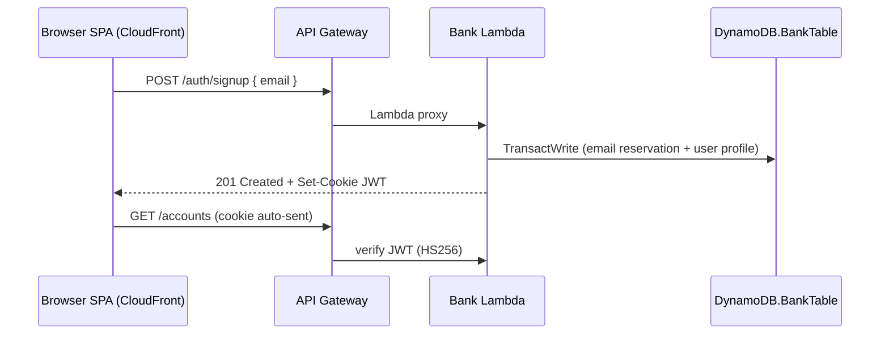

# Solution Design – Simplified Authentication

## Date

2025-07-01

## Context

This document refines the authentication flow defined in the requirements
(`docs/requirements/002-authentication.md`) and supersedes the cookie attribute
from ADR 003 via ADR 005.

- Users sign up / sign in with a single **Email address**. No passwords, no external IdP.
- Session token = 1-hour JWT delivered in `HttpOnly; Secure; SameSite=None` cookie.
- SPA (CloudFront) and API Gateway reside on different domains ⇒ cross-site cookie required.

Referenced docs: ADR 003, ADR 005, High-Level Design 001.

## Proposed Architecture

## Component Responsibilities

| Component              | Responsibility                                                                                                                                                                                                                                                                                                                      |
| ---------------------- | ----------------------------------------------------------------------------------------------------------------------------------------------------------------------------------------------------------------------------------------------------------------------------------------------------------------------------------- |
| **SPA**                | Sign-Up, Sign-In pages, shows UX errors & session-expired toast. No direct JWT access.                                                                                                                                                                                                                                              |
| **API Gateway**        | Single REST stage; forwards all paths to Bank Lambda.                                                                                                                                                                                                                                                                               |
| **Bank Lambda**        | Validates inputs, checks DynamoDB for user, issues/validates JWT, sets/clears cookie, handles business APIs.                                                                                                                                                                                                                        |
| **DynamoDB.BankTable** | **Single table design with two item types**: (1) Email reservations: `PK = EMAIL#{email}`, `SK = EMAIL` for uniqueness; (2) User profiles: `PK = USER#{userId}`, `SK = PROFILE` with attributes `email`, `createdAt`. Transaction ensures atomic creation. Designed to accommodate future entities (accounts, transactions, cards). |

## Technology & Frameworks

| Layer          | Choice                                               | Rationale                      |
| -------------- | ---------------------------------------------------- | ------------------------------ |
| JWT            | `jsonwebtoken` HS256                                 | Simple, no external key store. |
| Cookie signing | Same secret as JWT; emitted via `Set-Cookie` header. | Simplifies secret management.  |
| Persistence    | DynamoDB single table                                | Already selected in ADR 001.   |

## Security Review

| Vector          | Mitigation                                                                              |
| --------------- | --------------------------------------------------------------------------------------- |
| XSS token theft | JWT kept in `HttpOnly` cookie, unreadable to JS.                                        |
| CSRF            | Risk introduced by `SameSite=None`; accepted for demo; note future double-submit token. |
| Replay/window   | 1-hour TTL; consider shorter TTL + refresh in future.                                   |
| Secrets         | JWT secret stored in SSM Parameter Store; injected via env.                             |

## Testing Strategy (CI & e2e)

CI pipelines and local e2e tests will create a **new test user per run**.

1. Test code calls the **Sign-Up** endpoint with a randomly generated `test-<uuid>@example.com` email and adds a query parameter `?dev=true` (or header `X-Demo-Dev: 1`).
2. Bank Lambda detects the `dev` flag and marks the user record with `isTest=true` and **sets a DynamoDB TTL** so user data auto-expires after 24 h.
3. All subsequent API calls proceed normally using the issued cookie.

Safeguards (future/real-world):
• In a production environment the `dev` flag must be gated (e.g., signed header, stage variable) or disabled entirely to prevent misuse. This protection is **not** implemented in the demo; it is merely documented for completeness.  
• TTL cleanup means no manual teardown is required; test data is purged automatically.  
• Parallel CI jobs never collide because emails are random.

## Risks & Mitigations

- **CSRF exposure** → Accept for demo, document mitigation in ADR 005.
- **Test data growth** → Mitigated by 24 h TTL on `isTest=true` items.
- **Cold starts** → Auth adds negligible latency; still within 1 s p95.

## Cost Estimate (auth-specific)

### Assumptions

Based on **NFR-2** (_Design for 100 k users / 1 M events without re-architecture_) we adopt a "stress-but-still-demo" traffic model:

- **Users**: 100 000 active demo evaluators.
- **Log-ins per user / month**: 10 → **10 M authenticated API calls**.
- **New sign-ups per month**: 5 000 (≈5 % growth).

Pricing reference: eu-west-1, on-demand capacity.

| Resource                   | Quantity / Month                                            | Unit Price   | Cost        |
| -------------------------- | ----------------------------------------------------------- | ------------ | ----------- |
| Lambda requests            | 10 M × $0.20/M                                              | $0.002 / req | **$2.00**   |
| Lambda compute             | 128 MB · 50 ms → 0.00625 GB-s/inv × 10 M · $0.00001667/GB-s |              | ~$1.04      |
| DynamoDB writes (sign-ups) | 5 k WCU                                                     | $1.25/M      | $0.01       |
| DynamoDB reads (sign-ins)  | 10 M RCU                                                    | $0.25/M      | $2.50       |
| SSM Parameter              | 1 advanced param                                            | $0.05        | $0.05       |
| **Total**                  |                                                             |              | **≈ $5.60** |

The estimate remains well below typical demo budgets and satisfies **NFR-AUTH-7** (no noticeable idle-cost increase).
