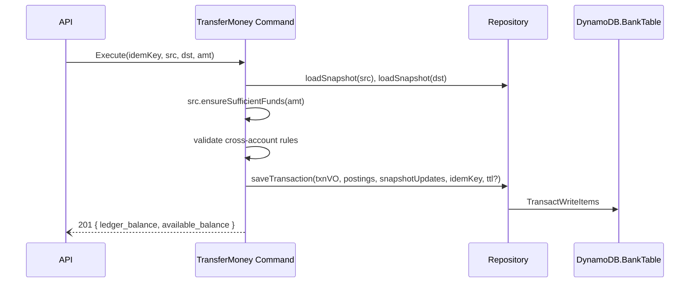

# Solution Design – Core Banking (Account Creation, Funding, Internal Transfer)

## Date

2025-07-05

## 1 Architectural Layers

```
API Lambda  -->  Application Layer (Commands / Queries) -->  Domain  -->  DynamoDB Repository
```

- **API (adapter)** – handles authorization, converts API requests to Commands & Queries.
- **Application layer** – orchestrates Commands & Queries, coordinates aggregates.
- **Domain** – pure objects: `Account`, `Transaction`, `Posting`.
- **Repository** – converts domain objects to DynamoDB single‑table items.

---

## 2 Domain Model

| Object              | Kind           | Responsibilities                                                                                                               |
| ------------------- | -------------- | ------------------------------------------------------------------------------------------------------------------------------ |
| **Account**         | Aggregate Root | Identity (`account_id`, `accountNumber`), balances, status; invariants such as `ensureSufficientFunds` or `ensureActive`.      |
| **Transaction**     | Value Object   | Immutable descriptor containing ordered Postings; already balanced on creation.                                                |
| **Posting**         | Value Object   | Atomic debit/credit line (`account_id`, `amount_minor`, `side`, `description`). The DB-only `posting_id` guarantees unique SK. |
| **BalanceSnapshot** | Projection     | Read‑model for fast balance fetch; updated synchronously or rebuilt from Postings.                                             |

---

## 3 Commands & Queries

| Command / Query                      | Key Business Rules                                                                              |
| ------------------------------------ | ----------------------------------------------------------------------------------------------- |
| `CreateAccount()`                    | Generate IDs; snapshot starts at 0; TTL if `isTest`.                                            |
| `FundAccount(amount)`                | Allowed only to fund user's own account < $1M at once                                           |
| `TransferMoney(src, dst, amt, memo)` | Destination exists & active (command); source `Account.ensureSufficientFunds(amt)` (aggregate). |
| `GetBalance(acct)`                   | Pure read                                                                                       |
| `ListTransactions(acct, page)`       | Pure read                                                                                       |

---

## 4 Processing Flow – TransferMoney



Snapshot rows are **ADD**‑updated in the same transaction for read‑your‑write consistency.  
A dormant Stream + Projector Lambda can replace the in‑transaction update when we switch to async projection.

---

## 5 DynamoDB Single‑Table Schema

| PK                   | SK            | Item Type       | Core Attributes                                              |
| -------------------- | ------------- | --------------- | ------------------------------------------------------------ |
| `ACCOUNT#<id>`       | `META`        | Account         | accountNumber, ownerUserId, createdAt, currency              |
| `ACCOUNT#<id>`       | `BALANCE`     | BalanceSnapshot | ledger_balance_minor, available_balance_minor, version, ttl? |
| `TXN#<txnId>`        | `META`        | TxnHeader       | type, status, createdAt, idempotencyKey, ttl?                |
| `TXN#<txnId>`        | `POST#<n>`    | Posting         | account_id, amount_minor, side, description                  |
| `IDEMPOTENCY#<hash>` | `<timestamp>` | Guard           | ttl?                                                         |

**GSI1** – `(PK = ACCOUNT#id, SK begins_with <txnTs>)` for transaction feed.

---

## 6 Scaling & Hot‑Key Mitigation

- Each Posting is its own item ⇒ 400 KB item limit not a concern.
- High‑traffic account → shard by appending numeric suffix to `ACCOUNT#id`. Not needed now.

---

## 7 Observability

- Structured logs incl. `txn_id`, duration, result.
- Metrics: `txn_create_p95_ms`, `transaction_failed`, `transaction_commited`, `account_created`.
