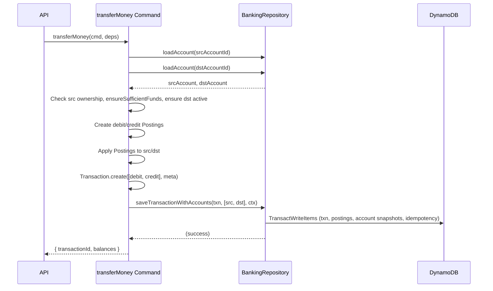

# Solution Design – Core Banking (Account Creation, Funding, Internal Transfer)

## Date

2025-07-05

## 1 Architectural Layers

```
API Lambda  -->  Application Layer (Commands / Queries) -->  Domain  -->  DynamoDB Repository
```

- **API (adapter)** – handles authorization, converts API requests to Commands & Queries.
- **Application layer** – orchestrates Commands & Queries, coordinates aggregates.
- **Domain** – pure objects: `Account`, `Transaction`, `Posting`.
- **Repository** – converts domain objects to DynamoDB single‑table items.

---

## 2 Domain Model

| Object              | Kind           | Responsibilities                                                                                                                                                                                                                                                                                                                                                  |
| ------------------- | -------------- | ----------------------------------------------------------------------------------------------------------------------------------------------------------------------------------------------------------------------------------------------------------------------------------------------------------------------------------------------------------------- |
| **Account**         | Aggregate Root | Identity (`accountId`, `accountNumber`), balances, status; invariants such as `ensureSufficientFunds` or `ensureActive`.                                                                                                                                                                                                                                          |
| **Transaction**     | Entity         | Represents a single, atomic movement of value across accounts. Contains an immutable, ordered set of Postings (debits and credits) that must be balanced (Σ debits = Σ credits) at creation. Enforces double-entry invariants, records type (FUNDING, TRANSFER), status, description, and idempotency key. Transaction identity is globally unique and immutable. |
| **Posting**         | Value Object   | Atomic debit/credit line (`accountId`, `amountMinor`, `side`, `description`). The DB-only `postingId` guarantees unique SK.                                                                                                                                                                                                                                       |
| **BalanceSnapshot** | Projection     | Read‑model for fast balance fetch; updated synchronously or rebuilt from Postings.                                                                                                                                                                                                                                                                                |

---

## 3 Commands & Queries

| Command / Query                      | Key Business Rules                                                                                     |
| ------------------------------------ | ------------------------------------------------------------------------------------------------------ |
| `CreateAccount()`                    | Generate IDs; snapshot starts at 0; TTL if `isTest`.                                                   |
| `FundAccount(amount)`                | Allowed only to fund user's own account < $1M at once                                                  |
| `TransferMoney(src, dst, amt, desc)` | Accounts exist and active, account ownership; source `Account.ensureSufficientFunds(amt)` (aggregate). |
| `GetAccount(accId)`                  | Pure read                                                                                              |
| `GetAccountByNumber(accNumber)`      | Pure read                                                                                              |
| `GetBalance(accId)`                  | Pure read                                                                                              |
| `ListAccounts(userId)`               | Pure read                                                                                              |
| `ListTransactions(acct, page)`       | Pure read                                                                                              |

---

## 4 Processing Flow – TransferMoney



Snapshot rows are **ADD**‑updated in the same transaction for read‑your‑write consistency.  
A dormant Stream + Projector Lambda can replace the in‑transaction update when we switch to async projection.

---

## 5 DynamoDB Single‑Table Schema

| PK                        | SK            | Item Type         | Core Attributes                                                                 |
| ------------------------- | ------------- | ----------------- | ------------------------------------------------------------------------------- |
| `ACCOUNT#<id>`            | `META`        | Account           | accountNumber, ownerUserId, createdAt, currency, BANKING_GSI1PK, BANKING_GSI1SK |
| `ACCOUNT#<id>`            | `BALANCE`     | BalanceSnapshot   | ledgerBalanceMinor, availableBalanceMinor, version, ttl?                        |
| `ACCOUNT_NUMBER#<number>` | `RESERVE`     | NumberReservation | accountId                                                                       |
| `TXN#<txnId>`             | `META`        | TxnHeader         | type, status, createdAt, description, idempotencyKey,                           |
| `TXN#<txnId>`             | `POST#<n>`    | Posting           | accountId, amountMinor, side, createdAt, BANKING_GSI2PK, BANKING_GSI2SK         |
| `IDEMPOTENCY#<hash>`      | `<timestamp>` | Guard             | ttl?                                                                            |

**BANKING_GSI1** – `(BANKING_GSI1PK = USER#id, BANKING_GSI1SK = createdAt)` list accounts per user.
**Account Number Lookup** – Uses direct item access with reservation pattern: `PK = ACCOUNT_NUMBER#number, SK = RESERVE` for account number to ID lookups.
**BANKING_GSI2** – `(BANKING_GSI2PK = ACCOUNT#id, BANKING_GSI2SK = POST#<createdAt>)` for transaction feed, sort by time

---

## 6 Scaling & Hot‑Key Mitigation

- Each Posting is its own item ⇒ 400 KB item limit not a concern.
- High‑traffic account → shard by appending numeric suffix to `ACCOUNT#id`. Not needed now.

---

## 7 Observability

- Structured logs incl. `txnId`, duration, result.
- Metrics: `txn_create_p95_ms`, `transaction_failed`, `transaction_commited`, `account_created`.
