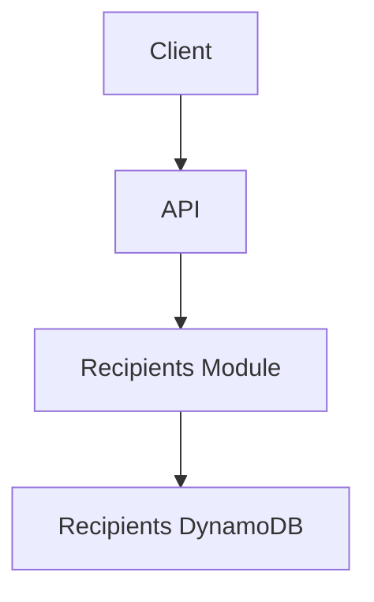

# Solution Design – Saved Recipients

## Date

2025-07-05

## Context

Users need to save, manage, and select recipients for transfers, improving UX and reducing errors. See [Problem Exploration – Saved Recipients](../problem-exploration/004-recipients.md) and [Requirements Specification – Saved Recipients](../requirements/004-recipients.md).

## Proposed Architecture



## Component Responsibilities

| Component         | Responsibility                                       |
| ----------------- | ---------------------------------------------------- |
| API               | HTTP gateway for CRUD on recipients                  |
| Recipients Module | Business logic, validation, hashing, uniqueness      |
| DynamoDB          | Store recipient records, enforce per-user uniqueness |

## Cost Estimation

| Item                | Monthly Cost (USD) | Notes                                 |
| ------------------- | ------------------ | ------------------------------------- |
| DynamoDB (100k ops) | <1.00              |                                       |
| Lambda (100k inv)   | ~0.04              | 128MB, 100ms, us-east-1, no free tier |

## Security Review

| Vector                  | Mitigation                   |
| ----------------------- | ---------------------------- |
| account number exposure | HMAC hash for account number |

## Risks & Mitigations

- Hashing logic and key must remain unchaged, upon change migration of existing data required (rehashing)
- Account number changes for a recipient require delete + insert (transaction)
- If hash secret is leaked, IDs could be reversed (mitigation: rotate secret -> migration)

## API Design

### Endpoints

- `GET /recipients` → List all user recipients
- `POST /recipients` → Add a new recipient
- `PUT /recipients/:recipientId` → Update name or other non account number property
- `POST /recipients/:recipientId/recreate` → Change account number (+ other properties) for recipient
- `DELETE /recipients/:recipientId` → Delete recipient

### Payload

```json
// POST /recipients
{
  "accountNumber": "PL61109010140000071219812874",
  "name": "Dad"
}
```

```json
// PUT /recipients/:recipientId
{
  "accountNumber": "PL999...",
  "name": "New Name"
}
```

```json
// POST /recipients/:recipientId/regenerate
{
  "accountNumber": "PL111...",
  "name": "New Name"
}
```

## Module Outline

```
libs/
  recipients/
    ├── domain/
    |   ├── entities
    |       ├── Recipient.ts
    ├── application/
    │   ├── commands/
    │   ├── queries/
    │   └── ports.ts
    ├── infrastructure/
    │   ├── DynamoRecipientRepository.ts
```

## Account Number Hashing

```ts
import crypto from 'crypto';

function recipientId(accountNumber: string): string {
  return crypto
    .createHmac('sha256', SECRET)
    .update(accountNumber)
    .digest('hex');
}
```

## DynamoDB Schema

| PK            | SK                              | Attributes          |
| ------------- | ------------------------------- | ------------------- |
| USER#<userId> | RECIPIENT#<hash(accountNumber)> | name, accountNumber |

- Enforces per-user uniqueness
- Allows efficient read/update/delete by `recipientId`
- No GSI or scan needed, query on main table by PK to list all recipients
