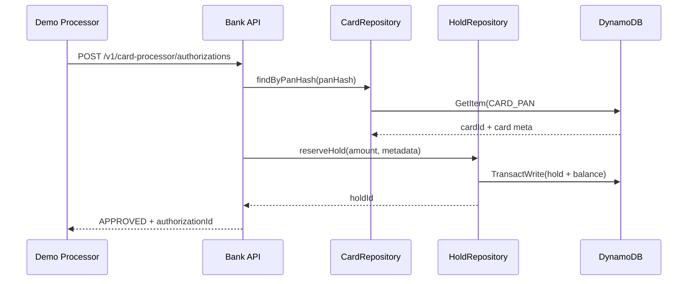
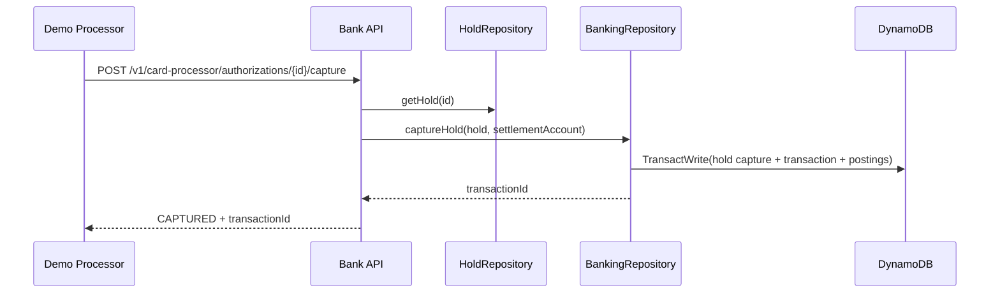

# Design - Card Issuing and Processor Integration

## Date

2026-01-15

## Summary

Extend Demo Bank to issue cards tied to accounts and act as the issuer for BIN
123456 cards, similar to a Synchrony-style store card program. Multiple cards
per account are supported, raw PAN/CVC are never stored, and CVC verification is
enforced. Authorization requests from the demo payment processor create holds.
Captures post ledger transfers to a card settlement account and appear in the
activity feed as both `HOLD_CAPTURED` and `POSTED_TRANSACTION` entries with
merchant details. Card freeze/unfreeze is out of scope in v1.

## Architecture

```text
Bank Web App --> Bank API (ts-rest) --> Banking Application (cards + holds)
                                         |
                                         v
                                      DynamoDB

Demo Payment Processor --> Bank API (issuer endpoints, service auth)
```

## Domain Model

```ts
type CardStatus = 'ACTIVE' | 'BLOCKED' | 'CLOSED' | 'EXPIRED';

interface Card {
  cardId: string;
  accountId: string;
  accountNumber: string;
  ownerUserId: string;
  cardholderName: string;
  panLast4: string;
  panHash: string;
  cvcHash: string;
  expiryMonth: number;
  expiryYear: number;
  status: CardStatus;
  createdAt: string;
  updatedAt: string;
}

interface CardMerchant {
  name: string;
  statementDescriptor?: string;
  categoryCode?: string;
  country?: string;
}

interface CardAuthMetadata {
  processorChargeId: string;
  cardId: string;
  cardLast4: string;
  merchant: CardMerchant;
}
```

Notes:

- We reuse the existing Hold entity for authorization. Hold and Transaction
  records receive extra metadata fields for card context (cardId, cardLast4,
  merchant fields, processorChargeId, authorizationId).
- Merchant metadata represents what an issuer typically receives from the
  network/acquirer (merchant name, descriptor, MCC, country). For the demo, the
  processor supplies these values so the bank can surface realistic activity
  lines.

## Commands and Queries

| Command / Query                                                   | Notes                                                           |
| ----------------------------------------------------------------- | --------------------------------------------------------------- |
| IssueCard(accountId, cardholderName?)                             | Validates ownership, generates PAN, expiry, CVC, status ACTIVE. |
| ListCards(userId, accountId?)                                     | Lists masked card info for the user.                            |
| GetCard(cardId)                                                   | Returns masked card details (no CVC).                           |
| AuthorizeCard(pan, exp, cvc, amount, merchant, processorChargeId) | Service auth, create hold, return authorizationId.              |
| CaptureAuthorization(authorizationId, amount)                     | Service auth, capture hold to settlement transfer.              |

## API Surface

User endpoints (cookie auth):

- `POST /v1/cards` issue a card (returns full PAN and CVC once).
- `GET /v1/cards?accountId=...` list cards (masked PAN only).
- `GET /v1/cards/{cardId}` get card (masked PAN only).

Processor endpoints (service auth):

- `POST /v1/card-processor/authorizations`
- `POST /v1/card-processor/authorizations/{authorizationId}/capture`

### Authorization request payload (processor)

```json
{
  "pan": "123456......",
  "expiryMonth": 1,
  "expiryYear": 2030,
  "cvc": "123",
  "amountMinor": 2500,
  "currency": "USD",
  "merchant": {
    "name": "Demo Shop",
    "statementDescriptor": "DEMO SHOP",
    "categoryCode": "5411",
    "country": "US"
  },
  "processorChargeId": "ch_123"
}
```

### Authorization response (processor)

```json
{
  "status": "APPROVED",
  "authorizationId": "hold_123",
  "cardId": "card_123",
  "accountNumber": "1234567890",
  "declineCode": null,
  "message": null
}
```

### Capture response (processor)

```json
{
  "status": "CAPTURED",
  "authorizationId": "hold_123",
  "transactionId": "txn_123"
}
```

## Card Number Generation

- BIN prefix: `123456`
- Length: 16 digits
- Format: `123456` + 9 random digits + 1 Luhn check digit
- Uniqueness: `CARD_PAN#<panHash>` lookup item created in the same transaction
  as the Card meta item. Condition `attribute_not_exists(PK)` prevents reuse.
- Storage: PAN is hashed using HMAC-SHA256 with an env secret; only `panLast4`
  is stored for display. CVC is generated at issuance and stored as a hash only.

## Authorization Flow (processor)



Validation rules:

- Card exists, status ACTIVE, and not expired.
- CVC must match stored hash.
- Account is active and has sufficient available balance.

Declines return `declineCode` and do not create holds.

## Capture Flow (processor)



The capture posts a transfer from the cardholder account to a dedicated
settlement account and links `originHoldId` to the authorization id.

## DynamoDB Schema Extensions

| PK                   | SK                   | Item Type            | Attributes                                                                                                                                                                                   |
| -------------------- | -------------------- | -------------------- | -------------------------------------------------------------------------------------------------------------------------------------------------------------------------------------------- |
| `CARD#<cardId>`      | `META`               | Card                 | accountId, accountNumber, ownerUserId, panLast4, panHash, cvcHash, expiryMonth, expiryYear, status, cardholderName, createdAt, updatedAt, CARD_GSI1PK, CARD_GSI1SK, CARD_GSI2PK, CARD_GSI2SK |
| `CARD_PAN#<panHash>` | `LOOKUP`             | CardPanLookup        | cardId, accountId, ownerUserId, status                                                                                                                                                       |
| `PROCESSOR#DEMO`     | `IDEMPOTENCY#<hash>` | ProcessorIdempotency | command, authorizationId, transactionId, createdAt, ttl                                                                                                                                      |

Hold META and Hold EVENT items gain optional card fields:

- `cardId`, `cardLast4`, `merchantName`, `statementDescriptor`,
  `merchantCategoryCode`, `processorChargeId`.

Transaction header gains optional card fields:

- `cardId`, `cardLast4`, `merchantName`, `statementDescriptor`,
  `processorChargeId`, `authorizationId`.

## Settlement Account

Add a dedicated internal account similar to `FUNDING_SOURCE`:

- `CARD_SETTLEMENT.ACCOUNT_ID = 'CARD_SETTLEMENT'`
- `CARD_SETTLEMENT.ACCOUNT_NUMBER = '9999999999'` (internal only)

Card capture transfers debit the user account and credit this settlement
account, preserving double-entry invariants.

## Activity Feed and UI

Activity feed:

- Hold events map to `HOLD_CREATED` and `HOLD_CAPTURED` with card metadata and
  merchant details.
- Capture also writes a `POSTED_TRANSACTION` item with card metadata and
  merchant name.

UI:

- Add a Cards panel in the account detail view.
- Issue Card flow shows full PAN and CVC once, with a warning to copy it.
- Card list shows status, last4, expiry, and account linkage.
- Activity timeline renders card authorizations and captures with merchant name,
  amount, and card last4.

## Auth and Security

- User endpoints use existing JWT cookie auth.
- Processor endpoints require a dedicated service token
  (`Authorization: Bearer <processorToken>`). Store the token in env config.
- Requests must include `Idempotency-Key` for authorization and capture.
- PAN/CVC are never logged; store only masked PAN and HMAC hashes.

## Error Handling

Authorization decline codes:

- `card_not_found`
- `card_inactive`
- `expired_card`
- `invalid_cvc`
- `insufficient_funds`

Capture errors:

- `authorization_not_found`
- `authorization_not_pending`
- `amount_mismatch`

## Observability

- Structured logs include: cardId, authorizationId, processorChargeId,
  accountNumber, result, latency.
- Metrics: `card_auth_success`, `card_auth_decline`, `card_capture_success`,
  `card_capture_error`.

## Risks and Follow-ups

- Partial capture and reversals are out of scope; keep amount == authorized.
- Consider card freeze/unfreeze once UI patterns are established.
- Add request signatures or HMAC timestamps if processor auth needs hardening.
