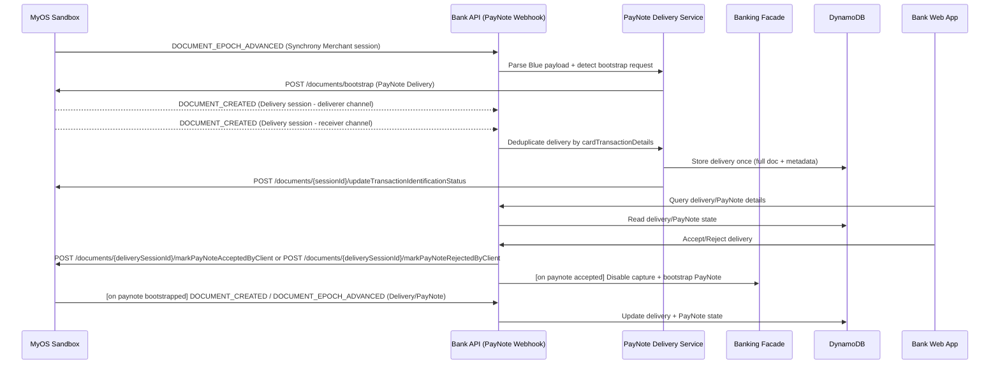

# Solution Design - PayNote Delivery Integration (Demo Bank)

## Date

2026-01-14

## Context

The demo bank must act as the PayNote deliverer and orchestrate PayNote Delivery
bootstrap, webhook-driven updates, transaction identification, and client
decisioning. This builds on the existing PayNote bootstrap/webhook flow while
adding Delivery-specific handling tied to card transaction details.

References:

- `docs/problem-exploration/007-paynote-integration.md`
- `docs/requirements/007-paynote-integration.md`

## Proposed Architecture

## Component Responsibilities

| Component                | Responsibility                                                                                                              |
| ------------------------ | --------------------------------------------------------------------------------------------------------------------------- |
| Bank Web App             | Surface delivery status, accept/reject actions, and PayNote details in the transaction/contracts UI.                        |
| Bank API                 | Receive MyOS webhooks, call MyOS operations, expose UI-facing delivery/PayNote endpoints.                                   |
| PayNote Delivery Service | Validate participant/channel fields, identify transaction/client from `cardTransactionDetails`, and persist delivery state. |
| Banking Facade           | Disable capture and bootstrap the PayNote on client acceptance.                                                             |
| MyOS Client              | Fetch events when needed and execute document operations in MyOS sandbox.                                                   |
| DynamoDB                 | Store PayNote Delivery docs, identification status, and PayNote lifecycle state.                                            |

## Technology & Frameworks

| Layer          | Choice                                           | Rationale                                                         |
| -------------- | ------------------------------------------------ | ----------------------------------------------------------------- |
| API            | ts-rest on AWS Lambda                            | Aligns with existing bank API stack.                              |
| Storage        | DynamoDB single table                            | Reuse existing persistence model for demo.                        |
| MyOS           | HTTP API (sandbox env)                           | Required for PayNote Delivery sessions and webhooks.              |
| Blue Documents | `@blue-labs/language` + `@blue-repository/types` | Type-safe parsing, validation, and serialization of PayNote docs. |
| UI             | React                                            | Reuse existing bank web app patterns for PayNote details.         |

## Cost Estimation

| Item                 | Monthly Cost (USD) | Source                               |
| -------------------- | ------------------ | ------------------------------------ |
| Lambda + API Gateway | 0 (existing usage) | Reuse current serverless stack       |
| DynamoDB storage     | 0 (existing usage) | Incremental PayNote docs are minimal |
| MyOS sandbox API     | 0 (dev env)        | Provided sandbox environment         |

## Security Review

| Vector               | Mitigation                                                                                                                                       |
| -------------------- | ------------------------------------------------------------------------------------------------------------------------------------------------ |
| Webhook authenticity | Not implemented in current bank webhook handler (route excluded from auth middleware); can be enabled outside local environments if added later. |
| Data exposure        | Store only PayNote Delivery + PayNote docs and `cardTransactionDetails` (no PAN).                                                                |
| Access control       | Only identified deliveries are surfaced to the mapped client.                                                                                    |
| Document integrity   | Validate participant/channel fields and Blue document types before acting.                                                                       |
| Transport            | TLS for all MyOS API calls and webhook delivery.                                                                                                 |

## Risks & Mitigations

- Webhook duplicates/out-of-order events may re-trigger operations; enforce idempotency by event id/session id.
- PayNote Delivery bootstrap is async; `DOCUMENT_CREATED` arrives for both deliverer and receiver sessions, so deduplicate delivery storage using `cardTransactionDetails`.
- Transaction identification may fail due to missing/mismatched `cardTransactionDetails`; report failure and keep delivery hidden.
- Webhook payload shape differences could break parsing; fallback to MyOS event fetch and verify against MyOS docs/tests.
- Local webhook forwarding reliability could block E2E; document forwarding setup and allow event replay.

## Open Questions

- None for this phase.
