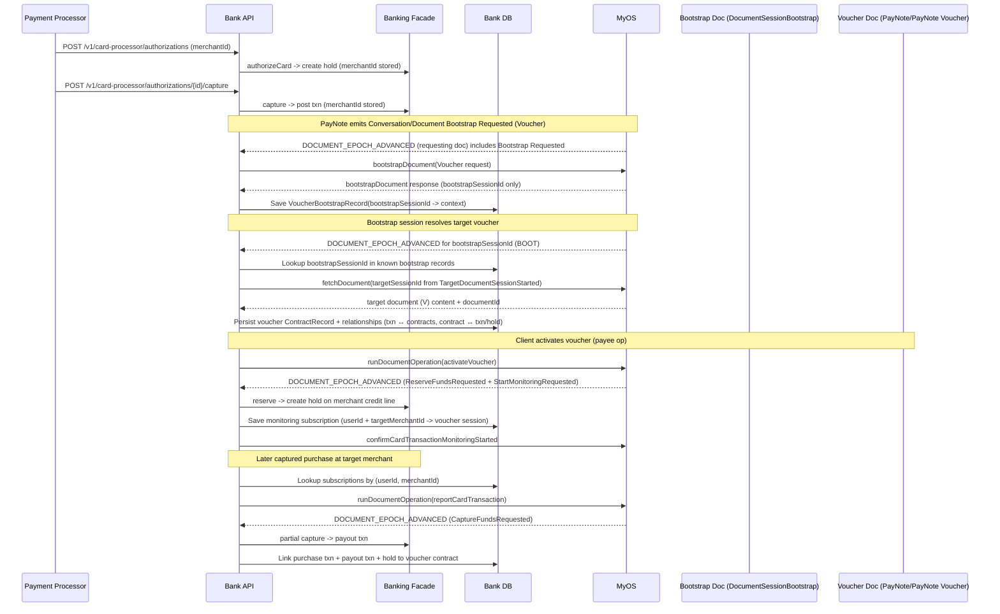

# Solution Design - PayNote Voucher Integration (Demo Bank)

## Date

2026-01-26

## Repository Placement

- Target path: `docs/design/011-paynote-voucher-integration.md`

## Assumed Blue Types (treated as existing for this repo)

- `PayNote/PayNote Voucher`
- `PayNote/Start Card Transaction Monitoring Requested`
- `PayNote/Card Transaction Monitoring Started`
- `PayNote/Card Transaction Monitoring Request Rejected`
- `PayNote/Card Transaction Report`
- `PayNote/Reserve Funds Requested`
- `PayNote/Capture Funds Requested`
- `PayNote/Eligible Card Transaction Reported`
- `PayNote/Ineligible Card Transaction Reported`
- `Conversation/Document Bootstrap Requested`
- `DocumentSessionBootstrap` (bootstrap tracking document type)

Time fields use conventional names (e.g., `requestedAt`, `occurredAt`) and are represented as Integer microseconds since epoch for now.

## Summary

We add voucher cashback support by extending the bank across five areas:

1. **Merchant identity + credit line**: merchant signup includes external `merchantId`, which maps to a merchant credit line account.
2. **Banking primitives**: implement partial capture against holds.
3. **Generic card transaction monitoring registry**: contracts request monitoring; bank confirms/rejects; bank reports captured purchases into document operations.
4. **Two-step MyOS bootstrap handling for Voucher**: bootstrap returns only the bootstrap tracking document; bank must resolve the target voucher session/document via bootstrap session webhooks (aligned with existing PayNote bootstrap flow).
5. **Voucher-specific webhook handling + UI correlation**: reserve funds on issuer credit line, pay cashback to client, and persist many-to-many relationships for UI.

## MyOS Bootstrap Model (Two-Step)

### Problem

MyOS `bootstrapDocument(...)` returns only information about the **bootstrap tracking document** (a `DocumentSessionBootstrap` session). It does not immediately return the target contract’s session/document id.

### Existing PayNote alignment

The bank already handles PayNote bootstrap this way:

1. Store the returned `payNoteBootstrapSessionId` (on the delivery record).
2. Listen to `DOCUMENT_EPOCH_ADVANCED` webhooks for the bootstrap session.
3. Parse `TargetDocumentSessionStarted` emitted events to obtain target session id(s).
4. `fetchDocument(targetSessionId)` to get the target document id/content.
5. Persist PayNote record and relationship links.

### Voucher approach

Voucher must follow the same flow:

- Call `bootstrapDocument(...)` when seeing `Conversation/Document Bootstrap Requested` for voucher.
- Persist the returned `voucherBootstrapSessionId` in a durable record linked to context (userId, rootTransactionId, requester paynote session/document).
- Process bootstrap session webhooks and resolve the created voucher session/document id(s) via `TargetDocumentSessionStarted` + `fetchDocument`.
- Persist voucher contract and relationship links.

### Optional fallback

The bank may also consume `DOCUMENT_CREATED` and correlate created voucher documents to pending bootstrap records by inspecting the created document content. This is optional. Primary path is bootstrap session updates, consistent with PayNote.

## Architecture Overview

## Component Responsibilities

| Component      | Responsibility                                                                                                                 |
| -------------- | ------------------------------------------------------------------------------------------------------------------------------ |
| Bank Web App   | Merchant signup UI, credit limit editing UI, voucher contract view (client), transaction details “Related contracts”.          |
| Bank API       | Receives MyOS webhooks, routes bootstrap/paynote/voucher events, calls MyOS bootstrap/operations, exposes UI-facing endpoints. |
| Banking Facade | Authorize/capture posting, credit line accounting, holds, partial capture payout.                                              |
| Persistence    | Stores contracts, reverse relationship index (txn → contracts), and monitoring subscriptions.                                  |
| MyOS Client    | Bootstraps voucher sessions and runs operations (`activateVoucher`, `reportCardTransaction`, confirm/reject monitoring).       |

## Data Model Changes

### 1) User

- Add `merchantId?: string` to persisted user profile.
- Introduce a `MerchantIdentityResolver` boundary to map `merchantId -> userId`.

### 2) Accounts (Credit Line)

Add account type `CREDIT_LINE` with:

- `creditLimitMinor`
- `ledgerBalanceMinor` (remaining credit after posted)
- `availableBalanceMinor` (remaining credit after holds)

### 3) Holds (Partial capture)

Extend hold state:

- `capturedAmountMinor`
- `status: PENDING | PARTIALLY_CAPTURED | CAPTURED`

Add a new command: `partialCaptureHold(...)` with idempotency keyed by `(voucherDocumentId, purchaseTransactionId)`.

### 4) Monitoring Subscriptions (Generic)

Store subscriptions keyed by `(userId, targetMerchantId)`:

- PK: `CARD_TXN_MON#USER#<userId>#MERCHANT#<targetMerchantId>`
- SK: `DOC#<documentSessionId>`
- attributes: `documentId`, `documentType`, `reportOperationName`, `status`, `startedAt`

### 5) Bootstrap Tracking Records (New)

Add a record to persist the 2-step bootstrap mapping for voucher:

- PK: `BOOTSTRAP#<voucherBootstrapSessionId>`
- attributes:
  - `bootstrapSessionId`
  - `requestedBySessionId` (the requesting doc session, e.g., PayNote)
  - `expectedTargetType` (Voucher)
  - `userId`
  - `rootTransactionId`
  - `createdAt`

This record is used by the bootstrap webhook handler to claim ownership of a bootstrap session id and to apply correct correlation when the target doc session is discovered.

> Note: PayNote bootstrap currently stores `payNoteBootstrapSessionId` on the PayNote Delivery record. Voucher can start with a dedicated bootstrap record. Later we can unify these into one generic `ContractBootstrapRecord` mechanism.

### 6) Relationships (many-to-many)

Add reverse index items for query efficiency:

- `TXN#<transactionId> -> CONTRACT#<contractId>`
- `HOLD#<holdId> -> CONTRACT#<contractId>`

## Bank API Changes

### Auth / Signup

- Signup request accepts optional `merchantId`.
- On merchant signup, create CREDIT_LINE account.

### Credit line limit management

- Add endpoint to update `creditLimitMinor` (demo convenience).

### Card processor endpoints

- Extend `CardMerchantDto` to include `merchantId`.
- Persist `merchantId` on authorization hold + posted transaction.

### Contracts / Relationships

- Add endpoint: “list related contracts by transactionId” to back the transaction details UI.

## Webhook Handling Design

### 1) Bootstrap webhooks (shared dispatcher recommended)

We will receive `DOCUMENT_EPOCH_ADVANCED` webhooks for `DocumentSessionBootstrap` sessions for both PayNote and Voucher bootstraps.

**Requirement:** Bootstrap webhook events must not be consumed by the wrong handler.

Recommended approach:

- Implement `handleBootstrapSessionWebhookEvent(...)` that:
  1. Parses `bootstrapSessionId` from the webhook object.
  2. Checks whether this `bootstrapSessionId` exists in:
     - PayNote bootstrap context (existing: delivery record by payNoteBootstrapSessionId), or
     - Voucher bootstrap context (new: VoucherBootstrapRecord).
  3. If no context exists, return **without marking the event processed**.
  4. If context exists, resolve `TargetDocumentSessionStarted` targets:
     - `fetchDocument(targetSessionId)`
     - validate expected type (Voucher vs PayNote)
     - persist target contract record and relationships
  5. Only then mark the webhook event processed.

This aligns with existing PayNote flow while preventing cross-type event loss.

### 2) Voucher webhook handler (reserve + monitoring + payout)

Create a voucher-specific handler (separate from existing PayNote handler) to process voucher session epochs:

- `PayNote/Reserve Funds Requested`  
  → create funding hold on issuer merchant credit line account (unique holdId)

- `PayNote/Start Card Transaction Monitoring Requested`  
  → validate + register monitoring subscription, then call voucher op:

  - confirm monitoring started, or
  - reject with reason

- `PayNote/Capture Funds Requested`  
  → perform partial capture payout to the client account derived from the referenced purchase `transactionId`

Idempotency:

- webhook event id for handler-level processing
- `(voucherDocumentId, purchaseTransactionId)` for payout processing

## Card Capture Reporting Hook

On successful capture/post:

1. Read `userId` (payer account owner) and `merchantId` (from txn metadata).
2. Lookup subscriptions by `(userId, merchantId)`.
3. For each active subscription:
   - call `runDocumentOperation(sessionId, reportOperationName, PayNote/Card Transaction Report)`
   - do not fail the capture if MyOS call fails; log and allow retry.

## UI Considerations

- **Client voucher view**: shows voucher, allows `activateVoucher`, shows related transactions and payouts.
- **Merchant view**: vouchers are read-only (no MyOS payer-channel ops) or hidden for now.
- **Transaction details**: show “Related contracts” sourced from reverse relationship index.
- **Contract details**: show “Related transactions” and “Related holds”.

## Testing Strategy (Repo-local)

- Unit tests:

  - bootstrap dispatcher claims correct bootstrap sessions and does not consume others
  - voucher bootstrap: stores bootstrapSessionId, resolves target session via TargetDocumentSessionStarted
  - credit line limit update invariants
  - partial capture transitions and idempotency
  - monitoring subscription registration/lookup
  - voucher handler reserve/capture idempotency

- E2E (happy path):
  - merchant signup -> credit line
  - paynote delivery -> voucher bootstrap (2-step)
  - activate voucher -> reserve + monitoring started
  - captured purchase at target merchant -> report -> capture funds requested -> payout

## Risks & Mitigations

- **Bootstrap event consumption across contract types** → implement shared bootstrap dispatcher or defer “mark processed” until ownership is proven.
- **Operation name injection** → validate report operation name against per-type allow-list.
- **Duplicate payouts** → enforce idempotency in partial capture and voucher handler.
- **Subscription growth** → keep keys narrow and enable disable/removal when voucher completes (later).
- **Merchant MyOS isolation** → keep merchant UI read-only for vouchers in this iteration.
