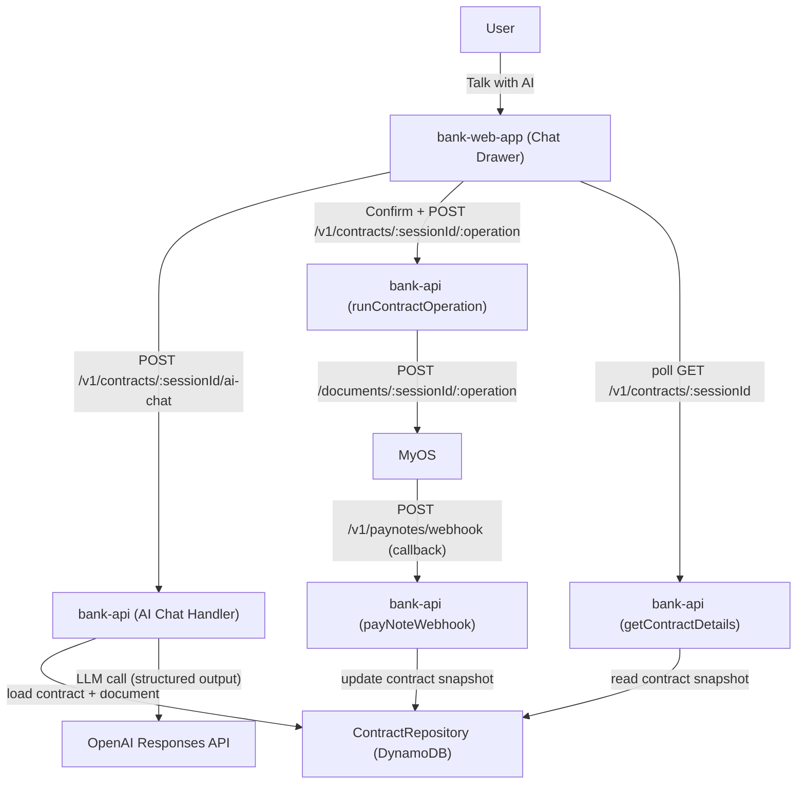

# Solution Design - AI Chat Contract Assistant (Demo Bank)

## Date

2026-02-04

## Context

We want an AI chat experience for an existing contract session that:

- answers questions about the current contract state,
- lists eligible operations (same filtering rules as the operations UI),
- guides the user through operation inputs,
- requires explicit confirmation before execution,
- executes operations via the existing contract operation API.

References:

- Problem exploration: `docs/problem-exploration/012-ai-chat-contract-assistant.md`
- Requirements: `docs/requirements/012-ai-chat-contract-assistant.md`
- Base prompt reference: `docs/research/bank-ai-prompt.md`
- UI design (Figma): https://www.figma.com/design/Qb1SKBGi7RwmWWIuj8G86Z/Bank-demo-app?node-id=163-26471&m=dev

## Proposed Architecture

## Key Design Decisions

### A) Eligible operations only (UI parity)

The assistant only “sees” and can propose operations that are eligible in the UI:

- root document contracts only,
- `Conversation/Operation` contracts only,
- must declare a `channel`,
- eligible when `channel` equals the supported contract’s `operationsChannelKey`, or when `channel` references a `Conversation/Composite Timeline Channel` that includes the supported contract’s `operationsChannelKey` (directly or nested).

This prevents the assistant from discovering or proposing hidden operations.

### B) Execution is always host-gated

The AI chat endpoint never runs operations directly. It only returns an
`operationRequest` payload when it is ready. The UI must require an explicit
confirmation click before calling `POST /v1/contracts/:sessionId/:operation`.

### C) Non-streaming MVP (AWS-first)

For MVP, the chat endpoint returns a single JSON response per user message.
The UI shows a “typing” indicator while waiting.

Streaming is explicitly deferred to a later iteration (see ADR 010).

## Component Responsibilities

| Component                       | Responsibility                                                                                                                                                                                                                    |
| ------------------------------- | --------------------------------------------------------------------------------------------------------------------------------------------------------------------------------------------------------------------------------- |
| bank-web-app                    | Entry point on contract card; renders chat drawer; manages ephemeral chat state; displays confirmation UI; calls AI chat endpoint; executes confirmed operations via existing API.                                                |
| bank-api (AI chat handler)      | Loads contract session document; computes eligible operations; calls LLM with a strict prompt + schema; validates/guards operation requests; returns a structured response.                                                       |
| bank-api (runContractOperation) | Executes MyOS document operations; performs ownership checks; returns execution status. Contract snapshots are updated via MyOS webhooks; the operation submission response alone does not imply the stored snapshot has changed. |
| Shared contract/type registry   | Provides `operationsChannelKey` and supported type metadata to ensure UI and backend agree on eligibility rules.                                                                                                                  |
| OpenAI                          | Generates structured answers and operation requests.                                                                                                                                                                              |
| MyOS                            | Executes document operations and drives state transitions.                                                                                                                                                                        |

## Backend: AI Chat Endpoint Design

### Endpoint

Add a dedicated endpoint (example):

- `POST /v1/contracts/:sessionId/ai-chat`

Note: this reserves the `ai-chat` path segment under `/v1/contracts/:sessionId/*`
and must not collide with operation contract keys.

### Input (request body)

MVP input:

- `messages[]`: chat history for the current view (ephemeral, sent from client).
  - Last N turns only (bounded).
  - Each message has `role: user|assistant` and `content`.

The server must not trust the client to supply the document or operation list.

### Server-side context (ground truth)

The handler loads:

- contract record by `sessionId` (auth-gated to contract owner) which includes the stored `document` snapshot,
- the current `document` snapshot (ground truth for chat),
- supported contract metadata (type registry),
- eligible operations computed from the document + operations channel key.

For operation inputs, the handler supplies the LLM with a compact, model-friendly
schema per operation:

- `operationKey`, `label`, `description`,
- `requestModel` describing required fields and types (derived via Blue runtime).

### Output (response body)

Return a strict JSON object matching `docs/research/bank-ai-prompt.md`:

- `assistantMessage`
- `status`: `answer` | `needs_more_info` | `ready` | `cannot_do`
- `nextProcessingState`: `none` | `collect` | `confirm`
- `focus`: optional guidance to the UI
- `operationRequest` only when `status="ready"`

### Validation and guardrails

Even with structured output, the server must enforce:

- if `operationRequest.operation` is present, it must be in the eligible
  operations list; otherwise downgrade to `cannot_do`.
- if an operation has a request schema:
  - require collected inputs to match expected types/shape,
  - surface one missing piece of information at a time.

## Frontend: Chat UX

### Entry point

Hook into the existing mocked “Talk with AI” affordance on the contract card
(post-rebase) and open the chat drawer.

### Conversation state

- In-memory only (per view instance).
- Closing the drawer resets history (MVP).

### Execution flow

1. User sends message.
2. UI calls AI endpoint with bounded chat history.
3. If response is `answer`: render message.
4. If `needs_more_info`: render the single question; next user reply continues.
5. If `ready`: render confirmation UI (include a payload preview), then on
   confirm call `POST /v1/contracts/:sessionId/:operation`.
6. On execution request success: show a “processing…” message/state while the
   contract snapshot catches up (contract snapshots are typically updated
   asynchronously via the MyOS webhook). Poll `GET /v1/contracts/:sessionId`
   until the contract `updatedAt` changes (or a bounded timeout), then append a
   human-readable outcome message (MVP can be app-generated; LLM-based
   post-execution narration is optional later).
7. On execution request failure: append a clear error message and do not enter
   processing mode.

## Security Review

| Vector                                 | Mitigation                                                                                                                             |
| -------------------------------------- | -------------------------------------------------------------------------------------------------------------------------------------- |
| Prompt injection from document content | Treat document content as untrusted data; system prompt forbids following instructions from the document; only use it as ground truth. |
| Unauthorized operation execution       | Restrict assistant to eligible operations; require UI confirmation; enforce server-side allowlist on `operationRequest.operation`.     |
| Data leakage in logs                   | Do not log raw chat messages or full document payloads at info level; use redaction/summaries in structured logs.                      |
| Cross-user access                      | Reuse existing auth and contract ownership checks (same as `runContractOperation`).                                                    |

## Risks & Mitigations

- **Latency variability**: show typing indicator; set a bounded timeout and retry UX.
- **Asynchronous state updates**: show “processing…” after operation submission and poll contract details until `updatedAt` changes (bounded).
- **Schema drift / large prompts**: send compact operation request models; avoid dumping full type repositories; cap history and document excerpts if needed.
- **Reserved-path collisions**: document and enforce reserved segments (for example `summary`, `ai-chat`) for operation keys.

## Open Questions

- Do we need a formal “reserved operation key” policy (lint/check) to prevent route collisions?
- Should the MVP show a raw JSON payload preview for confirmations, or a human-readable summary (plus expandable JSON)?
- What default model should be used for chat (and how should it be configured per environment)?
